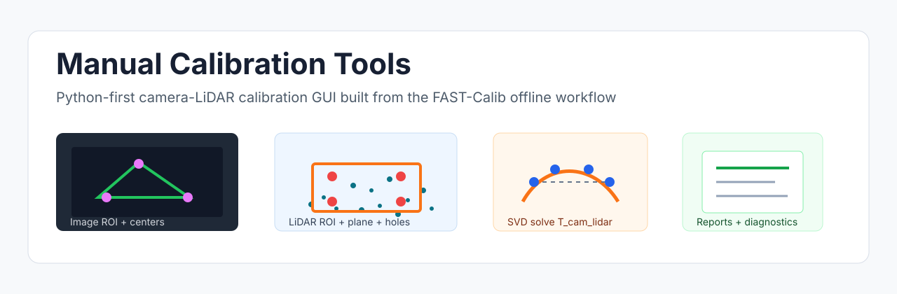
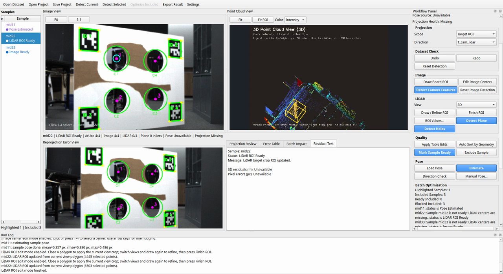
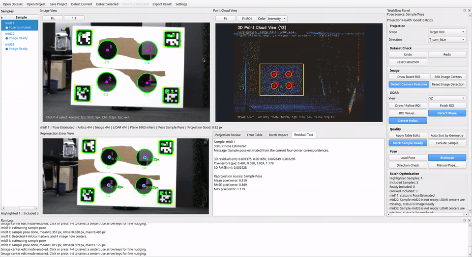
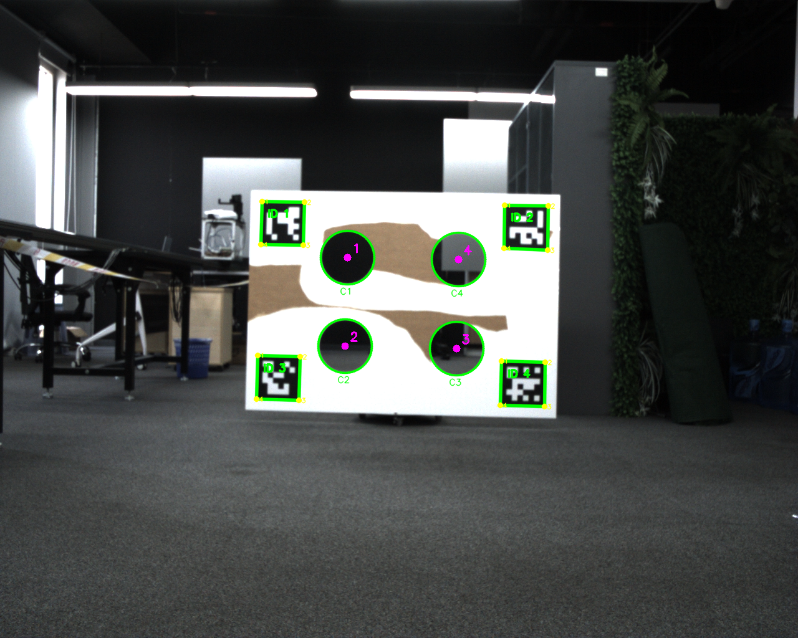
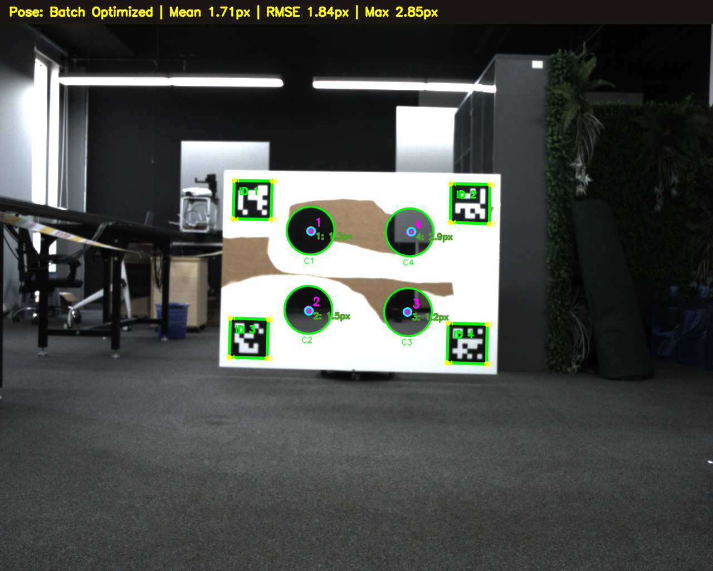
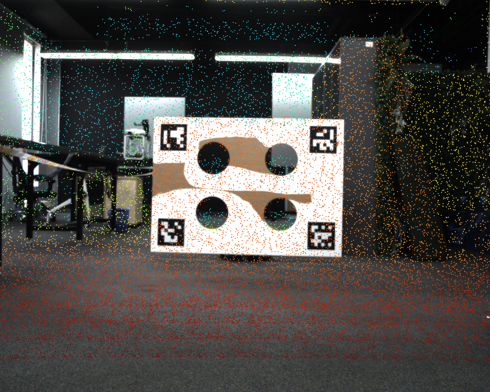
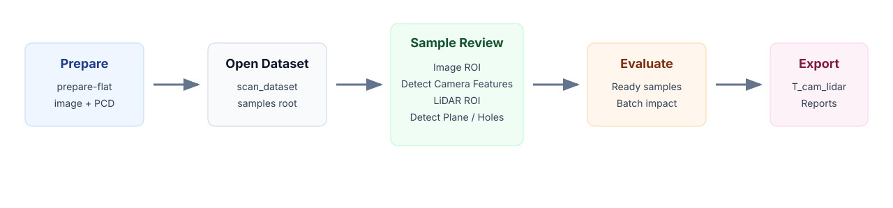

# Manual Calibration Tools

<p align="center">
  <a href="README.md">English</a> | <a href="README.zh.md"><strong>中文</strong></a>
</p>

<p align="center">
  
</p>

<p align="center">
  
  
  
  
  
  
  
</p>

<p align="center">
  <strong>作者</strong>：
  <a href="https://github.com/JokerJohn">Xiangcheng HU</a><br/>
  <strong>联系邮箱</strong>：<a href="mailto:xhubd@connect.ust.hk">xhubd@connect.ust.hk</a>
</p>

<p align="center">
  <strong>相关链接</strong>：
  <a href="https://github.com/hku-mars/FAST-Calib?tab=readme-ov-file">FAST-Calib</a>
  ·
  <a href="https://github.com/ethz-asl/kalibr">Kalibr</a>
</p>

面向相机-激光雷达以及后续多传感器外参标定任务的 Python 优先标定 GUI。

> **文档预览仓库。** 当前暂未公开源码。本仓库现阶段用于说明产品工作流、数据格式、环境规划、FAST-Calib v1 行为和后续路线图。v1 工作流以已有的 `fast_calib_offline_gui` 私有实现为功能真相；现阶段不要把该仓库理解成可直接运行的源码发布版。

## 项目目标

我们认为，标定任务的核心难点往往不在最后的优化器本身，而在进入优化器之前的观测质量：准确的 2D 像素特征点、准确的 3D 点，以及二者之间可靠的对应关系。

不管目标是标定板、圆孔点，还是其他结构化 pattern；不管最后采用解析法还是批量优化，最终精度上限都受这些观测特征点质量约束。因此 Manual Calibration Tools 的核心目标是：在接受最终外参前，让特征关联过程可见、可编辑、可量化。

v1 工作流首先围绕 FAST-Calib 风格的离线流程构建 GUI 层，让用户能够在 sample 级别检查和修正图像特征、LiDAR 特征、投影关系和重投影误差。

## 相关项目

Manual Calibration Tools 不是替代已有标定算法，而是面向标定观测侧的交互检查与修正层。

- [FAST-Calib](https://github.com/hku-mars/FAST-Calib?tab=readme-ov-file) 是当前 v1 相机-LiDAR target workflow 的算法参考。它提供了面向 solid-state 和 mechanical LiDAR 的高效 target-based LiDAR-camera 外参标定流程。
- [Kalibr](https://github.com/ethz-asl/kalibr) 是广泛使用的多相机、视觉惯性、多惯性和 rolling-shutter calibration 工具箱，代表了批量优化类标定工具。即便在这类方法中，高质量观测和稳定 target features 仍然是最终结果的基础。

## 效果预览

<p align="center">
  
</p>

GUI 将图像视图、点云视图、重投影误差视图、投影检查、sample 状态和 workflow controls 放在同一个工作台中。

## 热点功能：手动调整像素特征点并实时评估误差

<p align="center">
  
</p>

核心热点功能是手动细调图像圆心。类似测绘/摄影测量软件中的交互方式，用户可以选中某个圆心，用键盘精细移动像素位置，并立即查看重投影误差变化。这样可以在最终优化前选择更可靠的像素特征点，而不是把自动特征检测当成不可审查的黑盒结果。

## 项目简介

Manual Calibration Tools 的定位是可审查、可交互的标定工作台，而不是一键黑盒脚本。第一阶段将已有的 MID360 FAST-Calib 离线 GUI 工作流产品化：

- 使用离线 image/PCD sample 数据组织，不直接读取原始 rosbag；
- 使用 PySide6 桌面 GUI 完成样本检查、ROI 编辑、特征检测、投影检查和批量优化；
- 使用 OpenCV 的 ArUco/标定板位姿估计提取相机侧孔心；
- 使用 Open3D 相关能力完成点云读取、LiDAR ROI、平面和孔心检查；
- 支持手动调整图像中心点，并实时反馈重投影误差；
- 对确认后的中心对应关系执行刚体 SVD 求解；
- 导出可审查的外参、残差表、可视化诊断、运行 manifest 和 HTML/Markdown 报告。

后续项目会从 FAST-Calib v1 工作流扩展到标定板方案和更多外参标定任务。

## 结果展示

<p align="center">
  
  
  
</p>

导出的 artifacts 保留了最终 transform 背后的证据：图像特征检测、中心重投影残差和密集点云投影 overlay。

## v1 的功能真相

v1 文档严格对应当前已有实现：

| 模块 | 当前实现约定 |
|---|---|
| 入口 | `fast_calib_offline_gui/main.py`，支持 `gui` 和 `prepare-flat` |
| 数据准备 | `materialize_flat_mid360_dataset()` 和 `scan_dataset()` |
| 数据模型 | `DatasetProject`、`CalibrationSample`、`SampleAnnotation`、`CalibrationResult` |
| GUI 操作 | `Open Dataset`、`Detect Camera Features`、`Detect Plane`、`Detect Holes`、`Evaluate Batch`、`Optimize Included`、`Export Result` |
| 特征检测 | ArUco/标定板位姿、图像孔心、LiDAR ROI、目标平面、LiDAR 孔心 |
| 优化 | 基于确认后的中心对应关系，用刚体 SVD 求解 `T_cam_lidar` |
| 导出 | 外参文件、中心记录、人工标注、残差 CSV、可视化诊断、报告和 manifest |

本文档仓库不会重新定义另一套流程、状态机、目录结构或优化逻辑。

## 使用流程

<p align="center">
  
</p>

1. 使用 `prepare-flat` 把扁平的 `mid*.png + mid*.pcd` 数据整理成离线 dataset。
2. 在 GUI 中打开生成后的 `dataset_root`。GUI 不直接读取原始 rosbag。
3. 逐个 sample 检查图像、点云、元数据和可选 LiDAR ROI。
4. 在图像侧绘制 board ROI，运行 `Detect Camera Features` 得到相机侧孔心。
5. 在点云侧绘制或细化 LiDAR ROI，运行 `Detect Plane` 和 `Detect Holes`。
6. 检查四组编号后的 camera/LiDAR 中心对应关系、投影、残差和样本状态。
7. 将有效样本标记为 `Ready`，批量优化至少需要两个 included 的 `Ready` 样本。
8. 使用 `Evaluate Batch` 做只读的批量影响评估。
9. 使用 `Optimize Included` 求解 `T_cam_lidar` 并写入默认结果目录。
10. 需要复制结果树时，使用 `Export Result`。

## 数据目录

GUI 打开的必须是整理后的离线 dataset root：

```text
dataset_root/
  samples/
    mid22/
      image.png
      cloud.pcd
      meta.json
    mid33/
      image.png
      cloud.pcd
      meta.json
  camera_intrinsics.yaml
  board_config.yaml
```

`meta.json` 可以包含单个样本的 LiDAR ROI：

```json
{
  "sample_id": "mid22",
  "source_rosbag": "mid22.bag",
  "sync_ok": true,
  "preprocess_version": "custom-export-v1",
  "lidar_roi": {
    "x_min": 2.0,
    "x_max": 5.0,
    "y_min": -4.0,
    "y_max": 1.0,
    "z_min": 0.0,
    "z_max": 2.0
  }
}
```

完整数据约定见 [docs/DATASET.zh.md](docs/DATASET.zh.md)。

## 环境预览

当前私有 beta 运行环境是 Python-first，核心依赖包括：

- Ubuntu 20.04/22.04 风格桌面环境；
- Python 3.10 或更新版本；
- PySide6 桌面 GUI；
- 带 ArUco 支持的 OpenCV；
- Open3D 点云读取与检查；
- NumPy、数值计算工具和 PyYAML。

源码发布后，预计命令形态如下：

```bash
python -m fast_calib_offline_gui prepare-flat \
  --source-root /path/to/flat_mid360_data \
  --output-root /path/to/offline_dataset

python -m fast_calib_offline_gui gui
```

当前环境说明见 [docs/INSTALL.zh.md](docs/INSTALL.zh.md)。

## 导出结果

一次成功优化会写出：

```text
result_root/
  extrinsic_fastlivo2.txt
  extrinsic.yaml
  circle_center_record.txt
  manual_annotations.json
  run_manifest.json
  residual_summary.csv
  per_point_residuals.csv
  report.md
  report.html
  samples/
    mid22_image_features.png
    mid22_reprojection.png
    mid22_reprojection_error.png
    mid22_colored_cloud.pcd
  run.log
```

文件含义和检查方式见 [docs/OUTPUTS.zh.md](docs/OUTPUTS.zh.md)。

## 文档入口

- [安装与环境](docs/INSTALL.zh.md)
- [数据格式](docs/DATASET.zh.md)
- [GUI 使用流程](docs/WORKFLOW.zh.md)
- [输出与报告](docs/OUTPUTS.zh.md)
- [路线图](docs/ROADMAP.zh.md)
- [English README](README.md)

GitHub Wiki 源文件保存在 [wiki/](wiki/)。

## 路线图

| 阶段 | 范围 | 状态 |
|---|---|---|
| v1 | 产品化已有 FAST-Calib 离线 MID360 GUI 工作流 | 私有 beta / 文档预览 |
| v1.x | 改进打包、示例数据说明和报告呈现 | 计划中 |
| v2 | 扩展当前 FAST-Calib target 之外的标定板工作流 | 计划中 |
| v3 | 扩展到更多外参标定任务和传感器组合 | 计划中 |

## 许可证与源码状态

当前仓库暂不包含公开源码。未来源码发布计划采用 GNU GPLv3。源码发布前，实现细节仍未公开，本仓库应视为文档和项目规划材料。
